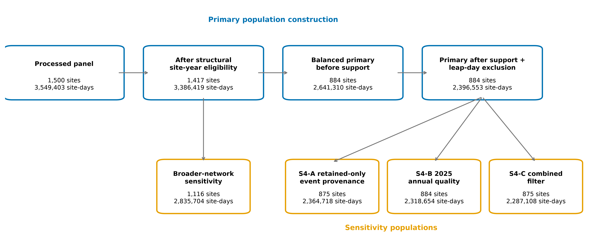
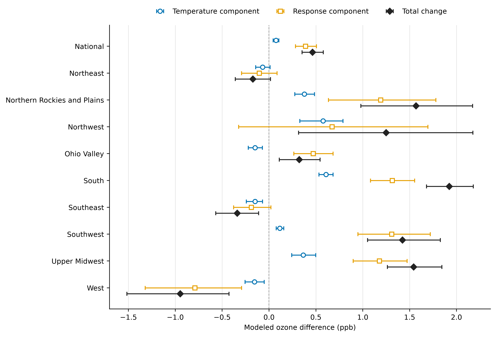
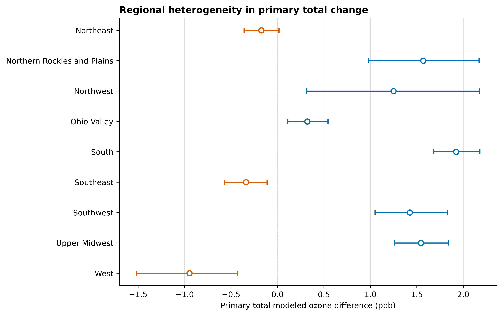
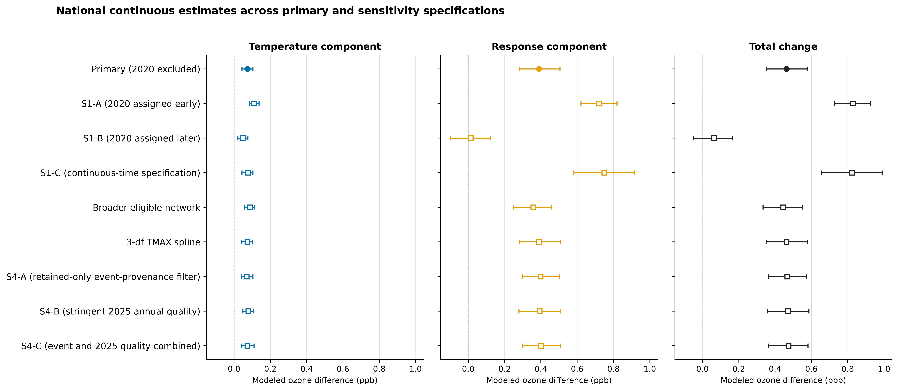
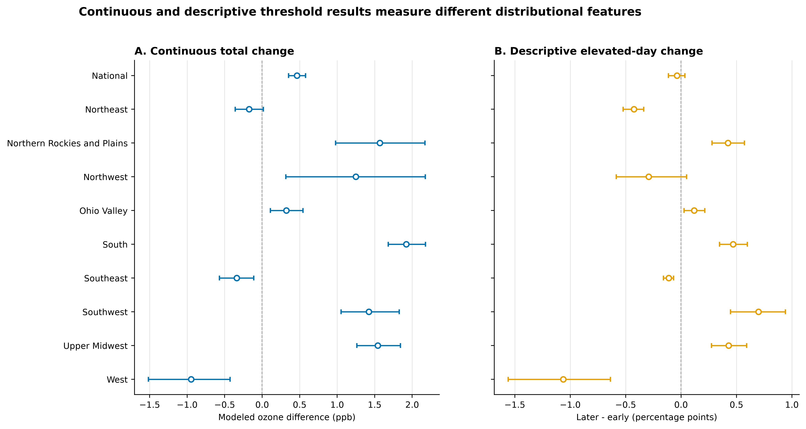

<header class="publication-title-block">
<h1>Temperature Distributions and Temperature-Standardized Ozone Change Across U.S. Monitoring Sites, 2015–2025</h1>

Ellis Varden

Independent Researcher

DOI: 10.5281/zenodo.21434897

Non-peer-reviewed preprint

</header>

::: {.structured-abstract}
## Abstract

### Background

Daily maximum temperature is associated with ground-level ozone, but a change
in observed ozone between periods can reflect both a changed temperature
distribution and a changed temperature-standardized ozone response. We asked
how these two components differed between 2015–2019 and
2021–2025 across represented monitoring sites in the contiguous
United States and District of Columbia.

### Methods

We analyzed untransformed continuous maximum daily 8-hour average ozone (MDA8)
concentrations from
884 balanced U.S. Environmental Protection Agency Air Quality
System (EPA AQS) monitoring sites
(2,396,553 site-days). Temperature came from matched NOAA/NCEI
GHCN-Daily stations. Within each region's common temperature support, we fit a
pooled block-diagonal, unregularized ordinary least-squares working model with
an identity link, site-specific indicator terms,
region-specific period intercepts,
region-period natural-cubic temperature terms, and region-period cyclic
seasonal terms. Fixed-calendar, equal-site standardization yielded a symmetric
two-period decomposition. NOAA-region-stratified whole-site resampling provided
1,000-replicate percentile intervals.

### Results

Nationally, the modeled later-minus-early ozone difference was
+0.46 ppb (95% bootstrap percentile interval
[0.35, 0.58]). The temperature-distribution component was
+0.07 ppb
([0.04, 0.10]), and the
temperature-standardized response component was
+0.39 ppb
([0.28, 0.51]). The response component was larger in
absolute magnitude nationally. Regional estimates were heterogeneous:
total point estimates were positive in Northern Rockies and Plains, Northwest, Ohio Valley, South, Southwest, and Upper Midwest; negative in Northeast, Southeast, and West; the Northeast total interval included zero. Treating 2020
differently produced the largest descriptive departure among the sensitivity
specifications: assigning 2020 to the later period yielded a total of +0.06 ppb ([-0.05, 0.16]). The broader-network,
lower-complexity temperature spline, and event-provenance and annual-quality analyses were
closer to the primary estimates: their national totals remained within 0.02 ppb of the primary estimate. In the
descriptive elevated-ozone analysis, the site-equal proportion changed from
1.42% to 1.38%, a
change of -0.04 percentage points
([-0.11, 0.03]).

### Conclusions

Across represented monitoring sites, the later period had a positive modeled
difference in continuous MDA8, with the temperature-standardized response
component larger than the temperature-distribution component nationally.
Regional patterns varied, and the estimate was sensitive to how
2020 was handled. The small negative descriptive
elevated-day point estimate, whose interval included zero, concerns a different feature
of the ozone distribution and is not a decomposition. The analysis is
associational. Whole-site resampling preserved each selected site's observed
time series, but the uncertainty procedure did not explicitly model serial
correlation within sites or spatial dependence across sites.

:::

## Keywords

ground-level ozone; maximum daily 8-hour average ozone; temperature;
monitoring sites; standardization; decomposition; whole-site bootstrap;
regional heterogeneity

## Introduction

Ground-level ozone varies with atmospheric chemistry, precursor availability,
transport, deposition, and meteorological conditions. Temperature is associated
with several ozone-conducive processes, and ozone–temperature relationships have
been documented in observational and model-based work
[@bloomer2009; @rasmussen2012; @pusede2015]. These relationships are not expected
to be spatially or temporally uniform. Studies have described geographic and
recent temporal variation in U.S. ozone–temperature relationships and ozone
trends [@ninneman2021; @nolte2021; @li2025; @chang2025; @bao2025]. The present
study therefore treats its contribution as an incremental, reproducible update,
not discovery of the basic association.

A later-minus-early ozone difference can arise through at least two statistical
paths. First, the distribution of daily maximum temperature can shift while the
fitted temperature–ozone response remains fixed. Second, the fitted ozone
response at a standardized temperature distribution can differ between periods.
A symmetric two-period decomposition separates these quantities without making
one period the sole reference and without assigning either component to a
specific physical or policy mechanism.

National aggregation can conceal regional variation in temperature ranges,
ozone seasonality, monitoring networks, and fitted response patterns. We
therefore estimated the decomposition within NOAA's framework of nine
climatically consistent regions in the contiguous United States
[@noaa_us_climate_regions], followed by equal-site national aggregation. The represented
sites define the target; they do not constitute a population-weighted sample of
U.S. people or places.

The study objective was to decompose the modeled difference in expected MDA8
between 2015–2019 and 2021–2025 into a
temperature-distribution component and a temperature-standardized response
component, nationally and by region. The exact frozen hypotheses were:

1. In eastern NOAA climate regions, later-period temperature conditions may
   tend to increase expected MDA8 ozone, while the temperature-standardized
   ozone response at comparable temperatures will be lower.
2. In much of the eastern United States, the negative
   temperature-standardized response component is expected to outweigh any
   positive temperature-distribution component, producing lower expected MDA8
   ozone overall.
3. Western regions are expected to show weaker, more heterogeneous, or
   potentially opposing response changes because background ozone, wildfire
   smoke, transport, terrain, and regional emissions sources may play larger
   roles.

These hypotheses are directional and associational. The frozen plan did not
define exact East/West memberships, quantitative directional thresholds,
point-versus-interval evidence, aggregation rules, sensitivity-disagreement
handling, or a categorical decision vocabulary. They are therefore reported
with descriptive evidence and the status **not formally adjudicable under the
frozen plan**. This status is a reporting-plan limitation, not a scientific
finding.

## Methods

### Study design and setting

This retrospective longitudinal analysis used public environmental-monitoring
records for the contiguous United States and District of Columbia. The source
window was January 1, 2015 through December 31, 2025. The primary comparison used equal-length early
and later periods, 2015–2019 and 2021–2025. We
excluded 2020 from the primary comparison to preserve
two symmetric five-year windows and because it lies at the boundary between
the defined periods; alternative assignments and a continuous-time
specification assessed sensitivity to that boundary choice. February
29 was omitted
to preserve a fixed non-leap seasonal calendar.

### Ozone data and site-day construction

Hourly ozone observations came from the U.S. Environmental Protection Agency
Air Quality System (EPA AQS)/AirData, using parameter
44201 and its documented bulk files
[@epa_formats; @epa_airdata]. Maximum daily 8-hour average ozone (MDA8) values
were reconstructed from rolling 8-hour averages. When multiple ozone monitors
were collocated, a prespecified conservative selection rule was used. Parameter
occurrence codes (POCs)
containing duplicate records for a site-hour were excluded; the site-hour was
retained only when exactly one eligible POC remained. Site-hours with multiple
remaining POCs were excluded rather than averaged or selected by priority.
Daily MDA8 construction followed the applicable EPA Appendix U
conventions [@ecfr_appendix_u]. Each candidate 8-hour window required at least
6 observed hourly values and averaged the 6–8 available values without
substituting missing hours; a daily MDA8 value required at least
13 of 17 valid
windows, with no concentration-dependent incomplete-day exception. Hourly
concentrations and 8-hour means were truncated, not rounded, to three decimal
ppm places before conversion to ppb (Supplement, Section S2.1). Primary data retained event-affected ambient
observations; the event-provenance analysis applied its separately frozen row
filter.

The primary outcome was continuous MDA8 in ppb without outcome transformation.
The descriptive elevated-ozone analysis used a binary indicator defined as
stored MDA8 after the specified truncation and before presentation rounding,
strictly above 70.0 ppb. That indicator is a
study-defined descriptive threshold, not a regulatory attainment or violation
measure.

### Temperature data and matching

Daily maximum temperature (TMAX) came from the National Oceanic and Atmospheric
Administration's National Centers for Environmental Information (NOAA/NCEI)
Global Historical Climatology Network–Daily (GHCN-Daily)
[@menne2012dataset; @menne2012overview]. Quality-accepted TMAX records were
converted to degrees Celsius and matched to EPA local-standard calendar dates.
Each coordinate episode was matched independently to the nearest eligible
station within 50 km with at least
90% coverage of that coordinate episode's
observed in-season dates by quality-accepted TMAX records. A coordinate episode
was a consecutive run of a site's observed in-season dates sharing the same EPA-reported
latitude and longitude; different episodes from one site could therefore use
different stations. The overlap denominator was the observed in-season ozone
dates within the coordinate episode, and the numerator was the subset with
quality-accepted TMAX. Distance and station identifier were deterministic tie
breakers.

### Eligibility, seasons, and analytical population

Using site, county, then state ozone-season precedence, a site-season-year
qualified when days with valid reconstructed MDA8 and quality-accepted matched
TMAX comprised at least 75% of all calendar days
in its applicable official ozone season. No separate monitor-operational subset
was used; February 29 counted when applicable. Primary sites required at least
4
qualifying years in each comparison period. The balanced primary population
contained 884 sites, 2,396,553 site-days,
1,192,343 early rows, and 1,204,210 later
rows. Eligibility was evaluated before common-support trimming and before
February 29 was removed from model fitting and standardization.

### Regions and common temperature support

::: {.keep-paragraph}
Sites were assigned to 9 NOAA climate regions
[@noaa_us_climate_regions]. The District of Columbia was assigned to the
Northeast under the study's prespecified state-to-region crosswalk. Within each
region, common support used 2 °C TMAX bins with at
least 30 eligible site-days in each period. A region
also required at least 20 sites. For each region and
period, the retained fraction was the number of eligible balanced-site rows in
retained common-support bins divided by all eligible balanced-site rows after
excluding 2020 and before common-support or February 29
trimming; at least 80% had to be retained.
Unsupported temperatures were not extrapolated.
:::

### Primary model

The primary specification was a pooled block-diagonal, unregularized ordinary
least-squares working model with an identity link. Nine regional normal-equation
solves were algebraically equivalent to the pooled block-diagonal fit and shared
one pooled spline-basis state. Each regional block contained site indicators, a
later-period intercept, and separate early/later four-column centered
natural-cubic TMAX and six-column centered cyclic day-of-year blocks. Because
sites did not cross regions and all other terms were region-specific, the blocks
formed the direct-sum factorization of the pooled design; no coefficient was
shared. The pooled
support-trimmed TMAX state used
boundaries
[-21.9, 51.7] °C and internal knots
[18.3, 25.6, 30.6] °C, calculated by the prespecified
linear-interpolation quantile method implemented in NumPy. No regularization,
outcome transformation, prediction clipping, or
additional covariate selection was used.

### Standardization and symmetric decomposition

For each site, the fixed represented calendar comprised the sorted distinct
non-February-29 day-of-year values in its support-trimmed early or later rows;
each represented day received equal weight. Period-specific empirical TMAX
frequencies supplied temperature weights. Predictions were averaged within site
over the Cartesian product of those temperatures and the fixed calendar before
equal-site regional and national aggregation.
This product construction treated the empirical temperature distribution
independently of calendar day for the standardized prediction.
The four standardized quantities were:

- A: early temperatures evaluated under the early fitted response;
- B: later temperatures evaluated under the early fitted response;
- C: early temperatures evaluated under the later fitted response; and
- D: later temperatures evaluated under the later fitted response.

The temperature-distribution component averaged the B-minus-A and D-minus-C
contrasts. The temperature-standardized response component averaged the
C-minus-A and D-minus-B contrasts. Their sum equaled the total D-minus-A
difference within the prespecified numerical tolerance. Sites were equally weighted
within regions and nationally; the national estimate was neither an unweighted
regional mean nor a site-day-weighted quantity.

### Bootstrap uncertainty

::: {.keep-paragraph}
The primary bootstrap sampled complete sites with replacement independently
within each NOAA region. Regional draw counts equaled primary site counts,
duplicate site draws received distinct site labels, and each selected draw
retained its complete early and later record. Replicate-specific support and
spline state were rebuilt under the primary bootstrap specification. We
targeted 1,000 successful replicates. Percentile intervals
used the 2.5th and
97.5th empirical quantiles, calculated by linear
interpolation using NumPy's `linear` method. No p-values or formal
intervals for differences between specifications were calculated.
:::

### Sensitivity analyses

The sensitivity and robustness program included:

1. three alternative treatments of 2020: assigning it to the early
   period, assigning it to the later period, and a prospectively clarified
   continuous-time specification with a transition-year-only intercept and
   endpoint standardization;
2. a broader network requiring at least
   1 qualifying year in each period,
   qualifying-site-year rows only, a common site set, and eligibility before
   support;
3. a lower-complexity temperature spline with exact pooled tertile-probability
   knots and otherwise unchanged model and population;
4. S4-A retained-only event-provenance filtering, S4-B stringent
   2025 annual-quality filtering, and their intersection S4-C;
   and
5. the prespecified continuous-model diagnostic suite and a prospectively
   defined descriptive elevated-ozone analysis.

Every sensitivity retained the frozen outcome, model, support, basis, and
weighting except where its documented scientific question explicitly changed
one of those elements. The post-freeze amendment chronology is reported in the
Supplement.

### Descriptive elevated-ozone analysis

For each primary site and period, the descriptive elevated-day proportion was
the number of retained days above 70.0 ppb
divided by valid retained days. Sites with zero elevated days remained. Regional
estimates averaged site-specific proportions within region; national estimates
averaged all 884 site-specific proportions. The change was
later minus early in percentage points. Secondary row-weighted counts and
proportions were labeled separately.

The descriptive analysis used the same validated site-resampling draws as the
primary bootstrap. Site-equal early, later, and percentage-point-change
summaries were calculated in each replicate. It did not use binomial intervals,
site-day resampling, a binary regression, or a threshold decomposition.

### Diagnostics and rejected binary model

Primary diagnostics assessed design rank, solver status, coefficient and
prediction finiteness, condition numbers, fitted range, residual quantiles,
period and region-period summaries, residual variance by fitted-value decile,
calibration, within-site lag-one residual correlation, and leverage diagnostics.
The median within-site lag-one residual correlation was
0.54, indicating substantial temporal autocorrelation.

::: {.keep-paragraph}
Whole-site resampling preserved each selected site's observed time series, but
the uncertainty procedure did not explicitly model serial correlation within
sites or spatial dependence across sites. Residual variance varied across
fitted-value deciles, consistent with heteroskedasticity; the complete decile
summaries appear in the Supplement.
:::

The 884-site population included
55 sites with no elevated days, so a finite
unregularized logistic maximum-likelihood estimate did not exist. Restricting the
analysis to the 829 sites containing both elevated and
non-elevated days still left quasi-complete separation in the Northwest. No
penalized, conditional, Bayesian, Firth, bias-reduced, or other rescue model was
fitted, and no binary coefficient or prediction is reported. The separate
descriptive threshold analysis retained all 884 sites and did
not fit a binary model.

### Software, reproducibility, and prospective amendments

The analysis used the frozen Python environment and frozen machine-readable
result records. Population, panel, configuration, code, bootstrap, and output
identities were checksum-validated. Point fits and decompositions were repeated
deterministically.

Continuous MDA8 was adopted as the primary outcome after the binary model
was found to be non-estimable and before any substantive continuous-model result was
examined. Several sensitivity definitions—including
the exact S1-C time form, broader-network population, tertile-knot spline,
Family 4 filters, and Family 5 descriptive estimand—were finalized after
earlier analyses had been completed but before results from the corresponding
analysis were examined. Bootstrap implementation rules for the 2020 family and
Family 4 were finalized after point estimates but before the associated
uncertainty intervals were calculated. The final hypothesis-reporting decision
was made after all analyses and governs reporting only.

## Results

### Study population

The source panel yielded 884 balanced sites and
2,396,553 support-trimmed site-days: 1,192,343 in
2015–2019 and 1,204,210 in
2021–2025. All 9 regions remained estimable.
Site and row distributions are summarized in Table 1 and Figure 1.

::: {.table-initial}
## Table 1. Study population and analytical design

| Category | Element | Primary specification |
| --- | --- | --- |
| Population | Represented sites | 884 |
| Population | Site-days | 2,396,553 |
| Periods | Early / later rows | 1,192,343 / 1,204,210 |

:::

::: {.table-continuation}
<table class="table-continuation-table">
<caption>Table 1 (continued)</caption>
<thead><tr>
<th>Category</th>
<th>Element</th>
<th>Primary specification</th>
</tr></thead>
<tbody>
<tr>
<td>Periods</td>
<td>Comparison</td>
<td>2015–2019 versus 2021–2025; 2020 excluded</td>
</tr>
<tr>
<td>Geography</td>
<td>NOAA climate regions</td>
<td>9</td>
</tr>
<tr>
<td>Eligibility</td>
<td>Completeness</td>
<td>≥75% of official-season calendar days with valid MDA8 and quality-accepted matched TMAX; ≥4 qualifying years per period</td>
</tr>
<tr>
<td>Support</td>
<td>Regional common support</td>
<td>2 °C bins; ≥30 rows per period; ≥20 sites; ≥80% of eligible balanced-site region-period rows retained after 2020 exclusion and before February 29 removal; 234 retained bins</td>
</tr>
<tr>
<td>Model</td>
<td>Working model</td>
<td>Pooled block-diagonal, unregularized ordinary least-squares working model with an identity link</td>
</tr>
<tr>
<td>Model</td>
<td>Terms</td>
<td>site fixed effects; region-specific later-period intercepts; region-by-period four-column centered natural-cubic TMAX basis; region-by-period six-column centered cyclic day-of-year basis</td>
</tr>
<tr>
<td>Uncertainty</td>
<td>Bootstrap</td>
<td>1,000-replicate NOAA-region-stratified whole-site percentile bootstrap</td>
</tr>
</tbody>
</table>

*Note:* Rows are site-days. The completeness denominator is every calendar day in the applicable official ozone season; the numerator requires valid reconstructed MDA8 and quality-accepted matched TMAX. February 29 is included in eligibility when it lies in the official season, then excluded from fitting and standardization. The represented monitoring sites are not population-weighted exposure estimates. The primary comparison excludes 2020. The common-support retention denominator is all eligible balanced-site rows in each region-period after 2020 exclusion and before common-support or February 29 trimming.

:::

<figure class="publication-figure" data-figure-number="1">

<figcaption>Figure 1. Monitoring-site analysis flow. The processed panel was restricted by frozen site-year completeness and balanced-site rules, regional common temperature support, and February 29 exclusion to the 884-site primary population. The broader-network and Family 4 populations are distinct sensitivity populations. Counts refer to represented monitoring sites and site-days, not people or a population-based sample.</figcaption>
</figure>

### Primary national decomposition

National A, B, C, and D were 42.07, 42.14,
42.45, and 42.53 ppb, respectively. The
temperature-distribution component was +0.07 ppb
([0.04, 0.10]), and the
temperature-standardized response component was +0.39
ppb ([0.28, 0.51]). The total modeled later-minus-early
difference was +0.46 ppb
([0.35, 0.58]). Both components were positive and
therefore reinforced each other; the response component was larger in absolute
magnitude.

### Regional heterogeneity

Regional estimates varied in direction and magnitude
(Table 2; Figures 2 and 3). Total point estimates were positive in Northern Rockies and Plains, Northwest, Ohio Valley, South, Southwest, and Upper Midwest; negative in Northeast, Southeast, and West. Temperature and
response components reinforced nationally and in eight regions, but opposed in the Ohio Valley.
Total intervals were entirely above zero in Northern Rockies and Plains, Northwest, Ohio Valley, South, Southwest, and Upper Midwest; entirely below zero in Southeast and West; and included zero in Northeast. The Northwest response interval also included zero.

::: {.single-page-table}
## Table 2. Primary national and regional decomposition

| Region | Sites | Temperature component, ppb [95% PI] | Response component, ppb [95% PI] | Total, ppb [95% PI] | Relation |
| --- | --- | --- | --- | --- | --- |
| National | 884 | +0.07 [0.04, 0.10] | +0.39 [0.28, 0.51] | +0.46 [0.35, 0.58] | reinforce |
| Northeast | 158 | -0.07 [-0.14, 0.01] | -0.10 [-0.29, 0.08] | -0.17 [-0.36, 0.02] | reinforce |
| Northern Rockies and Plains | 34 | +0.38 [0.27, 0.48] | +1.19 [0.63, 1.78] | +1.57 [0.98, 2.17] | reinforce |
| Northwest | 21 | +0.58 [0.33, 0.79] | +0.67 [-0.32, 1.69] | +1.25 [0.32, 2.17] | reinforce |
| Ohio Valley | 133 | -0.15 [-0.22, -0.07] | +0.47 [0.26, 0.68] | +0.32 [0.11, 0.54] | oppose |
| South | 128 | +0.61 [0.53, 0.68] | +1.31 [1.08, 1.55] | +1.92 [1.68, 2.18] | reinforce |
| Southeast | 136 | -0.15 [-0.24, -0.07] | -0.19 [-0.38, 0.02] | -0.34 [-0.57, -0.11] | reinforce |
| Southwest | 96 | +0.12 [0.08, 0.16] | +1.31 [0.95, 1.72] | +1.42 [1.05, 1.83] | reinforce |
| Upper Midwest | 59 | +0.36 [0.24, 0.50] | +1.18 [0.90, 1.47] | +1.54 [1.26, 1.84] | reinforce |
| West | 119 | -0.16 [-0.26, -0.05] | -0.79 [-1.32, -0.29] | -0.95 [-1.52, -0.43] | reinforce |

*Note:* Site-equal estimates compare 2015–2019 with 2021–2025. PI denotes the empirical 95% whole-site bootstrap percentile interval. Relation compares the signs of the temperature and response component point estimates; ‘reinforce’ and ‘oppose’ are descriptive sign patterns, not significance tests or causal mechanisms. The response component is temperature-standardized and associational, not causal.

:::

<figure class="publication-figure" data-figure-number="2">

<figcaption>Figure 2. Primary national and regional decomposition. Points show site-equal modeled ozone differences and horizontal bars show empirical 95% NOAA-region-stratified whole-site bootstrap percentile intervals. The response component is temperature-standardized and associational; the decomposition does not identify causal mechanisms.</figcaption>
</figure>

<figure class="publication-figure" data-figure-number="3">

<figcaption>Figure 3. Regional heterogeneity in the primary total modeled ozone difference. Horizontal bars are empirical 95% region-stratified whole-site bootstrap percentile intervals. Blue points denote positive point estimates and vermilion points denote negative point estimates; interval position, rather than color alone, determines relation to zero.</figcaption>
</figure>

### Bootstrap uncertainty

The primary bootstrap obtained 1,000 successful
replicates, all of which satisfied the prespecified population, support, rank,
decomposition-identity, and finite-value checks. The
national and regional percentile intervals are shown in Table 2.

### Sensitivity analyses

Table 3 and Figure 4 compare every continuous sensitivity with the primary
analysis. Across all national and regional component and total comparisons relative to the primary analysis, there were seven sign changes, 23 interval-relation changes, four component-relation changes, and 16 absolute point differences of at least 0.5 ppb. All sign changes, component-relation changes, and absolute point differences of at least 0.5 ppb occurred within the 2020 family. Interval-relation changes occurred in S1-A (six), S1-B (ten), S1-C (two), the broader-network analysis (four), and S4-C (one); the S4-C change was the Southeast response component, whose interval changed from including zero under the primary analysis to entirely below zero. The
specification assigning 2020 to the later period produced the largest descriptive
departure among the sensitivity specifications: its national response component was +0.01 ppb ([-0.10, 0.12]) and its total was +0.06 ppb ([-0.05, 0.16]).
Together, these results show that handling of 2020 is a
material sensitivity of the national estimate.

::: {.keep-paragraph}
The broader-network result used 1,116 sites and was
descriptively close to primary nationally, with the same national signs and component relation. The lower-complexity spline result was
nearly identical to primary nationally and regionally. S4-A, S4-B, and S4-C were
descriptively close to primary, with unchanged national signs, interval relations, and component relation. Regional sign, interval-relation, and
reinforce/oppose changes are reported completely in the Supplement; no formal
between-specification inference was performed.
:::

## Table 3. Sensitivity-analysis summary

| Specification | Population | Estimand (units) | Point | 95% PI | Difference from primary | Same sign as primary? | Same interval relation as primary? | Same component relation as primary? |
| --- | --- | --- | --- | --- | --- | --- | --- | --- |
| Primary (2020 excluded) | 884 sites; 2,396,553 fit rows | continuous total change (ppb) | +0.463 | [0.352, 0.579] | — | — | — | — |
| S1-A (2020 assigned early) | 952 sites; 2,788,753 fit rows | continuous total change (ppb) | +0.829 | [0.728, 0.926] | +0.366 | Yes | Yes | Yes |
| S1-B (2020 assigned later) | 936 sites; 2,773,587 fit rows | continuous total change (ppb) | +0.062 | [-0.050, 0.164] | -0.401 | Yes | No | Yes |
| S1-C (continuous-time specification) | 884 sites; 2,638,658 fit rows | continuous total change (ppb) | +0.825 | [0.657, 0.989] | +0.361 | Yes | Yes | Yes |
| Broader eligible network | 1,116 sites; 2,835,704 fit rows | continuous total change (ppb) | +0.444 | [0.333, 0.549] | -0.019 | Yes | Yes | Yes |
| Three-degree-of-freedom TMAX spline | 884 sites; 2,396,553 fit rows | continuous total change (ppb) | +0.463 | [0.352, 0.578] | −0.0005 | Yes | Yes | Yes |
| S4-A (retained-only event-provenance filter) | 875 sites; 2,364,718 fit rows | continuous total change (ppb) | +0.467 | [0.361, 0.573] | +0.003 | Yes | Yes | Yes |
| S4-B (stringent 2025 annual quality) | 884 sites; 2,318,654 fit rows | continuous total change (ppb) | +0.471 | [0.359, 0.586] | +0.007 | Yes | Yes | Yes |
| S4-C (event and 2025 quality combined) | 875 sites; 2,287,108 fit rows | continuous total change (ppb) | +0.473 | [0.364, 0.581] | +0.010 | Yes | Yes | Yes |
| Descriptive elevated-ozone analysis | 884 sites; 2,396,553 rows | later-minus-early change (percentage points) | -0.037 | [-0.115, 0.034] | Not comparable | Not comparable | Not comparable | Not comparable |

*Note:* The ‘Difference from primary’ column is descriptive; no interval or p-value was calculated for between-specification differences. The nonzero three-degree-of-freedom spline difference that would round to zero at three decimals is shown to four decimals to preserve its sign. Interval relation identifies whether the 95% bootstrap percentile interval is above zero, below zero, or includes zero; component relation identifies whether the temperature and response components reinforce or oppose. The threshold row uses percentage points and must not be compared quantitatively with ppb. All continuous intervals are whole-site bootstrap percentile intervals.

<figure class="publication-figure" data-figure-number="4">

<figcaption>Figure 4. National estimates across the primary and continuous sensitivity specifications. Points show site-equal estimates and horizontal bars show empirical 95% whole-site bootstrap percentile intervals. Panels share the same ppb axis. The compact label "3-df TMAX spline" denotes the three-degree-of-freedom TMAX spline. Differences across specifications are descriptive; no formal between-specification inference was performed.</figcaption>
</figure>

### Descriptive elevated-ozone results

The national equal-site elevated-day percentage was
1.42% in the early period and
1.38% in the later period. The later-minus-early
change was -0.04 percentage points
([-0.11, 0.03]), and its interval included zero.
Change intervals were entirely above zero in Northern Rockies and Plains, Ohio Valley, South, Southwest, and Upper Midwest; entirely below zero in Northeast, Southeast, and West; and included zero in Northwest. The national descriptive point
estimate was negative and differed in sign from the positive continuous-total
point estimate, but the two
quantities measure different distributional features and are not competing
estimates of one estimand.

## Table 4. Descriptive elevated-ozone results

| Region | Sites | Early, % [95% PI] | Later, % [95% PI] | Change, percentage points [95% PI] | Point-estimate sign vs continuous total |
| --- | --- | --- | --- | --- | --- |
| National | 884 | 1.42 [1.24, 1.60] | 1.38 [1.20, 1.56] | -0.04 [-0.11, 0.03] | differing |
| Northeast | 158 | 1.16 [0.98, 1.35] | 0.73 [0.60, 0.88] | -0.43 [-0.52, -0.34] | concordant |
| Northern Rockies and Plains | 34 | 0.13 [0.06, 0.22] | 0.55 [0.43, 0.70] | +0.42 [0.28, 0.57] | concordant |
| Northwest | 21 | 0.90 [0.57, 1.29] | 0.61 [0.25, 1.01] | -0.29 [-0.58, 0.05] | differing |
| Ohio Valley | 133 | 0.71 [0.59, 0.85] | 0.82 [0.71, 0.96] | +0.12 [0.03, 0.21] | concordant |
| South | 128 | 0.76 [0.62, 0.92] | 1.23 [1.00, 1.50] | +0.47 [0.35, 0.60] | concordant |
| Southeast | 136 | 0.28 [0.21, 0.37] | 0.17 [0.13, 0.23] | -0.11 [-0.16, -0.07] | concordant |
| Southwest | 96 | 1.32 [1.06, 1.59] | 2.02 [1.65, 2.40] | +0.70 [0.45, 0.94] | concordant |
| Upper Midwest | 59 | 0.85 [0.61, 1.14] | 1.28 [1.03, 1.57] | +0.43 [0.27, 0.59] | concordant |
| West | 119 | 5.39 [4.17, 6.76] | 4.33 [3.11, 5.60] | -1.06 [-1.56, -0.64] | concordant |

*Note:* Elevated ozone is stored MDA8 after the specified truncation and before presentation rounding, strictly above 70.0 ppb. Percentages are equal-site means, not pooled site-day percentages. ‘Concordant’ means the threshold-change and continuous-total point estimates have the same sign; ‘differing’ means their signs differ. The descriptive change is not a decomposition and uses unlike units from the continuous result.

<figure class="publication-figure" data-figure-number="5">

<figcaption>Figure 5. Primary continuous total modeled ozone differences (panel A, ppb) and descriptive changes in the equal-site proportion of days with stored MDA8 after the specified truncation and before presentation rounding, strictly above 70.0 ppb (panel B, percentage points). Points and bars are estimates and empirical 95% whole-site bootstrap percentile intervals. Separate axes prevent quantitative comparison of unlike units; the threshold result is not a decomposition and is not directly comparable with the continuous estimand.</figcaption>
</figure>

### Model diagnostics and binary-model failure

All nine regional design matrices were full rank, all solvers completed successfully, and all coefficients and predictions were finite. Across the nine regional blocks, the direct-sum design contained 1,073 columns and had summed rank 1,073. The root mean square error (RMSE) was 8.99 ppb; fitted values ranged from 15.15 to 80.57 ppb, and none was below zero or above the observed maximum. The median within-site lag-one residual
correlation of 0.54 indicated substantial temporal
autocorrelation.

The 884-site population included
55 sites with no elevated days, and a finite
unregularized logistic maximum-likelihood estimate did not exist. Restriction to the
829 sites containing both elevated and non-elevated
days still left
quasi-complete separation in the Northwest. No penalized, conditional,
Bayesian, Firth, bias-reduced, or other rescue model was fitted. This model
failure was distinct from the descriptive threshold analysis.

## Discussion

### Principal findings

::: {.keep-paragraph}
Across represented monitoring sites, the primary continuous analysis estimated
a positive national modeled MDA8 difference between the later and early
periods. The temperature-standardized response component was larger in absolute
magnitude than the temperature-distribution component nationally. Regional
patterns were heterogeneous, with positive total point estimates in several interior and southern regions, negative total point estimates in the West and Southeast, and a Northeast interval that included zero. Alternative
handling of 2020 materially changed the national response
and total, whereas broader-network, lower-complexity spline, and event-provenance
and annual-quality analyses were descriptively closer to the primary result.
:::

The descriptive elevated-day analysis produced a small negative national point
estimate whose interval included zero. This does not
contradict the positive difference in continuous MDA8: an equal-site modeled
mean difference and the frequency above a fixed upper threshold describe
different features of the ozone distribution. The descriptive threshold result
was not decomposed into temperature and response components.

### Interpretation of the response component

The response component describes how the fitted ozone response differed between
periods after standardizing temperature distributions and calendar weights. It
is not causal and cannot distinguish precursor emissions, smoke, humidity,
wind, transport, deposition, monitoring changes, or other unmeasured factors.
The response component's larger absolute magnitude nationally is a statistical
feature of the fitted response, not evidence of a mechanism or policy change.

### Regional heterogeneity

The largest positive primary total point estimates occurred in the South, Northern Rockies and Plains, Upper Midwest, and Southwest. The West and Southeast had negative total point estimates. The Northeast total and both components had intervals including zero; the Northwest response interval also included zero. In the Ohio Valley, a negative temperature component opposed a larger positive response component. Regional estimates should be read within their
represented monitoring-site populations and supported temperature ranges.
Differences among regions may reflect multiple measured and unmeasured
conditions; the analysis does not identify a specific explanation.

### Why transition-year handling matters

Assigning 2020 to the later period reduced the national response component from +0.39 to +0.01 ppb and the total from +0.46 to +0.06 ppb; both S1-B intervals included zero. The 2020 sensitivity family was prespecified to
assess exclusion or assignment of the boundary year to a comparison period;
the exact S1-C continuous-time form was prospectively clarified under the
documented amendment chronology before the corresponding sensitivity result
was available. The observed variation across these specifications limits any
interpretation that depends on one period boundary. No interval or p-value was calculated for
between-specification differences.

### Other sensitivity analyses

National totals for the broader network, three-degree-of-freedom TMAX spline, and all three Family 4 filters differed from primary by less than 0.02 ppb, although regional differences are reported in full. The broader network examined dependence
on the primary four-qualifying-year restriction. The lower-complexity spline
changed only TMAX functional-form complexity. Family 4 changed event-provenance
or annual-quality row inclusion while retaining the primary support and basis.
Despite their numerical proximity to the primary analysis, these sensitivities
addressed distinct population, functional-form, and data-quality questions.

### Relationship to previous work

::: {.keep-paragraph}
The temperature–ozone association and its regional variability are established
topics [@bloomer2009; @rasmussen2012; @pusede2015; @ninneman2021; @nolte2021].
Recent U.S. work also examines changing ozone–temperature relationships and
ozone trends [@li2025; @chang2025; @bao2025]. Wells et al. and Camalier et al.
estimated ozone trends adjusted for interannual meteorological variability
[@wells2021_meteorological_ozone; @camalier2007_meteorology_ozone]. The present
study instead decomposes a two-period modeled difference into a
temperature-distribution component and a temperature-standardized response
component. Its contribution is a transparent represented-site decomposition
through 2025, with complete reporting of the specified and
prospectively amended sensitivity analyses and diagnostics. The targeted literature review was not systematic and
cannot establish priority or superiority.
:::

### Strengths and limitations

Strengths include immutable official-source snapshots, an auditable site-day
construction, outcome-independent matching and completeness rules, balanced
cross-period sites, explicit common temperature support, equal-site
standardization, a symmetric decomposition, whole-site resampling, complete
reporting of all specified and prospectively amended sensitivity analyses, and
deterministic reproduction checks.

Several limitations are central. First, the design is observational and
associational; the response component is not causal. Second, represented
monitoring sites are not a population-weighted measure of people, places, or
personal exposure.

::: {.keep-paragraph}
Third, residuals showed substantial within-site temporal autocorrelation.
Whole-site resampling preserved each selected site's observed time series, but
the uncertainty procedure did not explicitly model serial correlation within
sites or spatial dependence across sites.
:::

Fourth, residual
variance varied across fitted-value deciles, consistent with heteroskedasticity.
Fifth, the empirical site network changed over time, and
the primary balanced-network restriction trades broader coverage for
cross-period comparability. Sixth, conclusions were sensitive to handling of
2020. Seventh, event provenance and
2025 annual completeness/certification came from source fields
whose interpretation and timing required prospective amendments. EPA's CY2025
guidance states that certification reflects agency submission and
validation, gives a May 1, 2026 certification deadline, notes that data may
remain under review and change before that deadline, advises outside users to
exercise caution during that period, and distinguishes certification from EPA
evaluation flags [@epa2026_cy2025_certification]. The Family 4 rules were
prospectively frozen study filters, not EPA-recommended analytical inclusion
rules.

::: {.keep-paragraph}
Eighth, the unregularized identity-link ordinary least-squares working model
does not constrain predictions to be nonnegative; fitted values
in this analysis nevertheless remained within the observed outcome range.
Diagnostics were disclosed rather than used to select another estimator.
Ninth, the descriptive threshold analysis
measures a different feature of the ozone distribution and is not a substitute
for the continuous decomposition. Tenth, the original binary site-indicator
model was structurally non-estimable. The outcome-dependent
829-site restriction was examined only as an
estimability check and still showed quasi-complete separation in the Northwest;
no fitted outcome-selected, penalized, conditional, Bayesian, Firth,
bias-reduced, or other rescue model was reported. Eleventh, humidity, wind,
transport, precursor
conditions, smoke, and other meteorological or emissions-related factors were
not directly modeled. The analysis makes no direct emissions, smoke,
regulatory, policy, or population-exposure attribution.
:::

Finally, several definitions were prospectively amended after earlier results
were available, although each family-specific rule was fixed before results
from the corresponding sensitivity analysis were examined. Bootstrap
implementation rules were finalized after point estimates but before the
associated uncertainty intervals were calculated. Hypothesis reporting was
resolved only after all analyses: because the frozen plan lacked a unique
decision rule, all hypotheses remain **not formally adjudicable under the frozen
plan**.

## Conclusion

::: {.keep-paragraph}
The primary continuous analysis found a positive site-equal modeled MDA8
difference between 2015–2019 and 2021–2025 across
represented U.S. monitoring sites, with a larger national
temperature-standardized response component than the temperature-distribution
component and substantial regional heterogeneity. The result was especially
sensitive to handling of 2020, while the broader-network,
lower-complexity spline, and event-provenance and annual-quality analyses were descriptively
closer to primary. The descriptive elevated-day point estimate was in the
opposite direction nationally, although its interval included zero;
that distinct estimand does not estimate the same quantity as the continuous
decomposition. Findings are associational and should be interpreted within the
represented monitoring network and limitations related to temporal and spatial
dependence.
:::

## Data availability

The analysis uses public EPA AQS/AirData and NOAA/NCEI GHCN-Daily records
[@epa_formats; @epa_airdata; @menne2012dataset]. EPA states that AQS ambient
monitoring data are public domain and may be downloaded and used without
requesting permission [@epa_airdata_public_domain]. Raw-source URLs,
retrieval metadata, byte sizes, and checksums are documented in repository
manifests. The processed analytical panel is not distributed with this version. Its possible future release remains subject to a separate redistribution review.

## Code availability

Curated code and reproducibility materials are publicly available at <https://github.com/vardenellis/temperature-ozone-us-2015-2025>. The processed analytical panel is not included, and full reconstruction requires the official EPA and NOAA source records under the frozen acquisition rules. No separate software DOI has yet been issued.

## Ethics statement

This study used public environmental-monitoring records, enrolled no human
participants, used no individual-level personal information, and required no
human-subject intervention or consent.

## Funding

This research received no external funding.

## Conflicts of interest

The author declares no competing interests.

## Author contributions

Ellis Varden: Conceptualization, Methodology, Software, Validation, Formal
analysis, Investigation, Data curation, Writing—original draft,
Writing—review and editing, Visualization, and Project administration.

::: {.declaration-section}
## AI assistance

AI-assisted tools contributed to planning, code scaffolding, source discovery,
draft editing, and reporting automation. The author remains responsible
for source verification, methodological decisions, execution, interpretation,
and final content. No numerical finding is included without a machine-readable
artifact and traceability record.

:::

## References

::: {#refs}
:::
